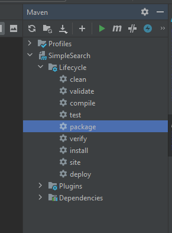
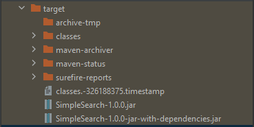

# Simple Search
> Èric Martín Obispo

### Coding Exercise Instructions
The exercise is to write a command line driven text search engine, usage being

```java mainClassFile pathToDirectoryContainingTextFiles```

This should read all the text files in the given directory, building an in-memory representation
of the files and their contents, and then give a command prompt at which interactive
searches can be performed.

An example session might look like:
```
$ java jar
SimpleSearch.jar /foo/bar
14 files read in directory /foo/bar
search>
search> to be or not to be
filename1 : 100%
filename2 : 95%
search>
search> cats
no matches found
search> :quit
$
```
**I.e.** the search should take the words given on the command prompt and return a list of the
top 10 (max) matching filenames in rank order, giving the rank score against each match.

**Note:** treat the above as an outline spec; you don’t need to exactly reproduce the above
output. Don’t spend too much time on input handling, just assume sane input.

##### Ranking
* The rank score must be 100% if a file contains all the words
* It must be 0% if it contains none of the words
* It should be between 0 and 100 if it contains only some of the words but the exact
ranking formula is up to you to choose and implement

##### Things to consider in your implementation
* What constitutes a word
* What constitutes two words being equal (and matching)
* Data structure design: the in memory representation to search against
* Ranking score design: start with something basic then iterate as time allows
* Testability


### Build
A pre-packaged JAR is already provided to avoid building the project.

In case the project wants to be build, those are the available options:

##### Using Maven commands
```
mvn package
```
If the project is already packaged, the following command will be needed:
```
mvn clean
```
##### Using IntelliJ
Same procedure but using IntelliJ's UI.




In both cases, two JAR files will be generated inside *Target* folder.


The package phase creates two JAR files:
* *SimpleSearch-1.0.0.jar:* JAR file containing the project code
* *SimpleSearch-1.0.0-jar-with-dependencies.jar:* Fat JAR file that contains the packaged project code and all it's dependencies.

In the next steps we will be working with *SimpleSearch-1.0.0-jar-with-dependencies.jar:* for simplicity.


### Run
*runSimpleSearch.sh* has been prepared to simplify the project execution:

It can be done in the following way:
* If your current directory is */SimpleSearch/bin*, it can be executed using the default arguments.
```
sh runSimpleSearch.sh
```
* In case you would like to execute the code from another location, it can be done in the following way:
```
sh runSimpleSearch.sh JAR_FILE INDEXABLE_DIRECTORY
```
**I.e.**
```
sh runSimpleSearch.sh ../target/SimpleSearch-1.0.0-jar-with-dependencies.jar ../input/
```


